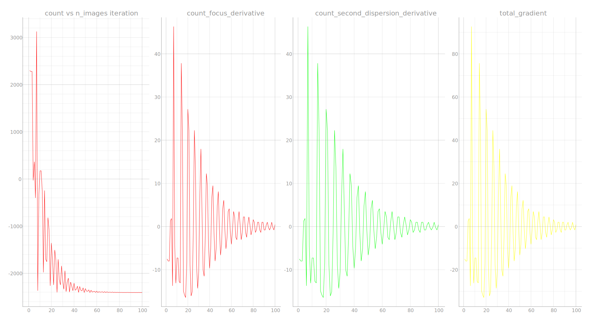
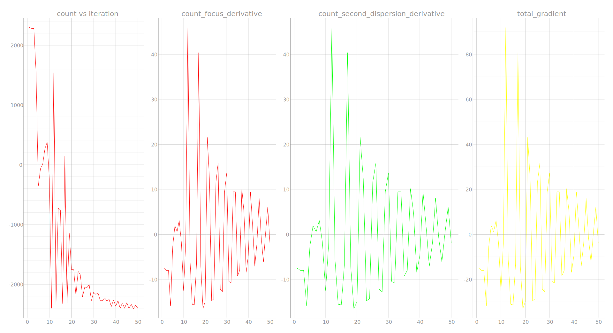

#### Project Description
The upgrade to Adaptive Moment Estimation (ADAM) offers a more robust optimization solution by combining key ideas from Root Mean Square Propagation (RMSprop), and Momentum Gradient Descent. It promises faster optimization and better handling of non-convex functions. 

Generally speaking, the implementation of Adaptive Moment Estimation offers:
- Better probability for absolute optimization of non-convex functions
- Faster convergence to optimal solution
- Bias correction to counter inevitable initialization biases
- Lighter computation power and memory usage
#### Theoretical background
Let me explain the mathematical description of Adaptive Moment Estimation (ADAM) by first separately tackling Momentum Gradient Descent and RMSprop.
###### Momentum Gradient Descent
The momentum gradient descent algorithm builds upon the the vanilla gradient descent algorithm — $\theta_{t+1}=\theta_{t}-\gamma \nabla f(\theta_{n})$ — by adding a momentum term to the expression. This term builds up momentum in the direction of the previous gradients, smoothing out the updates and assisting to faster convergence.

$$\theta_{t+1}=\theta_{t}+\beta(\theta_{t}-\theta_{t-1})-\gamma \nabla f(\theta_{n})$$

Here, $\gamma$ is the learning rate, and $\beta$ is the momentum decay factor.

###### Root Mean Square Propagation (RMSprop)
RMSprop adjusts the learning rates of individual parameters in real-time according to the gradient history. It addresses problems faced by momentum gradient descent including slow convergence and parameter oscillation. The algorithm accomplishes this by keeping track of a moving average of the squared gradients which scale the learning rates.

$$\theta_{t+1}=\theta_{t}-\frac{\gamma \cdot \nabla f(\theta_{t})}{\sqrt{ v_{t} + \epsilon }}$$
$$v_{t}=\beta  \cdot v_{t-1}+(1-\beta)\cdot(\nabla g(\theta_{t}))^2$$

Here, $v_{t}$ describes the running mean of squared gradients at a certain iteration $t$, and $\beta$ is the momentum decay factor as presented in the momentum gradient descent algorithm.
###### Adaptive Moment Estimation (ADAM)
The Adaptive Moment Estimation algorithm combines RMSprop and momentum gradient descent to form a robust optimization solution which is capable of tackling a broader range of non-convex functions.

```math
\begin{gather*}
m_{t}=\beta_{1}m_{t-1}+(1-\beta_{1})(\nabla f(\theta_{t})), \; \; \; \hat{m}_{t}=\frac{m_{t}}{1-{(\beta_{1}})^{t}} \\
v_{t}=\beta_{2}v_{t-1}+(1-\beta_{2})(\nabla f(\theta_{t}))^2,\;\; \hat{v}_{t}=\frac{v_{t}}{1-{(\beta_{2}})^{t}} \\
\theta _{t+1}=\theta_{t}-\frac{\alpha\cdot \hat{m}_{t}}{\sqrt{ \hat{ v_{t}}}+\epsilon}
\end{gather*}
```
Here, $v_{t}$ is the running mean of squared gradients as presented in RMSprop, and $m_{t}$ is the momentum estimate as presented in momentum gradient descent algorithm. $\hat{m_{t}}$, and $\hat{v_{t}}$ are the biased momentum and squared gradients respectively. They correctly help adjust the parameters by scaling them based on the number of iterations.

#### Implementation of ADAM in Python
To implement Adaptive Moment Estimation in our Betatron X-ray count optimization system, I made the following additions to the previous momentum gradient descent code:

Since the learning rates are dynamic, my program now includes the initial learning rate values and the new `epsilon` constant which ensures the algorithm does not divides by zero:

```python
self.epsilon = 1e-8
self.momentum_decay_one = 0.9
self.momentum_decay_two = 0.999
self.initial_focus_learning_rate = 0.1
self.initial_second_dispersion_learning_rate = 0.1
self.initial_third_dispersion_learning_rate = 0.1
```

Here, `self.momentum_decay_one`, and `self.momentum_decay_two` represent $\beta_{1}$ and $\beta_{2}$ respectively as presented above.

To keep track of the evolution of the system, I modified the program to include the following `numpy` lists:

```python
# learning rates modified to lists to hold new adjusted values
self.focus_learning_rate_history = np.array([])
self.second_dispersion_learning_rate_history = np.array([])
self.third_dispersion_learning_rate_history = np.array([])

# track evolution of momentum estimates and squared gradients
self.momentum_estimate_history = np.array([])
self.squared_gradient_history = np.array([])

# track evolution of biased momentum estimates and biased squared gradients 
self.biased_momentum_estimate_history = np.array([])
self.biased_squared_gradient_history = np.array([])
```


I will now translate the mathematical expressions as introduced previously to python code:

$$m_{t}=\beta_{1}m_{t-1}+(1-\beta_{1})(\nabla f(\theta_{t}))$$
```python
# updating the new momentum estimate
self.new_momentum_estimate = (self.momentum_decay_one*self.momentum_estimate_history[-1]) + ((1-self.momentum_decay_one)*(self.focus_der_history[-1]))

# appending the new estimate to its dedicated list
self.momentum_estimate_history = np.append(self.momentum_estimate_history, self.new_momentum_estimate)
```

$$v_{t}=\beta_{2}v_{t-1}+(1-\beta_{2})(\nabla f(\theta_{t}))^2$$
```python
# updating the new squared gradient 
self.new_squared_gradient_estimate = (self.momentum_decay_two*self.squared_gradient_history[-1]) + ((1-self.momentum_decay_two)*((self.focus_der_history[-1])**2))

# appending the new squared gradient to its dedicated list
self.squared_gradient_history = np.append(self.squared_gradient_history, self.new_squared_gradient_estimate)
```

$$\hat{m}_{t}=\frac{m_{t}}{1-{(\beta_{1}})^{t}}$$
```python
# updating the new biased momentum estimate
self.new_biased_momentum = ((self.momentum_estimate_history[-1])/(1-((self.momentum_decay_one)**self.n_images_run_count)))

# appending the new biased momentum to its dedicated list
self.biased_momentum_estimate_history = np.append(self.biased_momentum_estimate_history, self.new_biased_momentum)
```
```math
\hat{v}_{t}=\frac{v_{t}}{1-{(\beta_{2}})^{t}}
```

```python
# updating the new squared gradient
self.new_biased_squared_momentum = ((self.squared_momentum_estimate_history[-1])/(1-((self.momentum_decay_two)**self.n_images_run_count)))

# appending the new squared gradient to its dedicated list
self.biased_squared_momentum_history = np.append(self.biased_squared_momentum_history, self.new_biased_squared_momentum)
```

 *It's worth noting that the expression's $t$ — the iteration number — is expressed as `n_images_run_count` in the code for more stable optimization.

```math
\theta _{t+1}=\theta_{t}-\frac{\alpha\cdot \hat{m}_{t}}{\sqrt{ \hat{ v_{t}}}+\epsilon}
```

```python
# for every parameter we update the new value based on the latest lists values
self.new_focus = self.focus_history[-1] - ((self.focus_learning_rate_history[-1]*self.biased_momentum_estimate_history[-1])/(np.sqrt(self.biased_squared_momentum_history[-1])+self.epsilon))
```

Accordingly, I have placed the biased and unbiased squared gradient, and momentum estimate calculations in fitting functions:

```python
def calc_estimated_momentum(self):
	
	# calculate unbiased momentum estimate
	self.new_momentum_estimate = (self.momentum_decay_one*self.momentum_estimate_history[-1]) + ((1-self.momentum_decay_one)*(self.focus_der_history[-1]))
	
	self.momentum_estimate_history = np.append(self.momentum_estimate_history, self.new_momentum_estimate)
	
	# calculate biased momentum estimate
	self.new_biased_momentum = ((self.momentum_estimate_history[-1])/(1-((self.momentum_decay_one)**self.n_images_run_count)))
	
	self.biased_momentum_estimate_history = np.append(self.biased_momentum_estimate_history, self.new_biased_momentum)
	
def calc_squared_grad(self):
	
	# calculate unbiased squared gradient
	self.new_squared_gradient_estimate = (self.momentum_decay_two*self.squared_gradient_history[-1]) + ((1-self.momentum_decay_two)*((self.focus_der_history[-1])**2))
	
	self.squared_gradient_history = np.append(self.squared_gradient_history, self.new_squared_gradient_estimate)
	
	# calculate biased squared gradient
	self.new_biased_squared_momentum = ((self.squared_gradient_history[-1])/(1-((self.momentum_decay_two)**self.n_images_run_count)))
	
	self.biased_squared_momentum_history = np.append(self.biased_squared_momentum_history, self.new_biased_squared_momentum)
```

Expanding the focus update logic as presented above to the rest of the parameters, the modified `optimize_count()` function takes the following form:

```python
def optimize_count(self):
	derivatives = self.calc_derivatives()
	self.calc_estimated_momentum() # calc estimated biased and unbaised momentum estimates
	self.calc_squared_grad() # calc estimated biased and unbaised squared gradient estimates
	if np.abs(self.focus_learning_rate_history[-1] * derivatives["focus"]) > 1:
		self.new_focus = self.focus_history[-1] - ((self.focus_learning_rate_history[-1]*self.biased_momentum_estimate_history[-1])/(np.sqrt(self.biased_squared_momentum_history[-1])+self.epsilon))
		self.new_focus = np.clip(self.new_focus, self.FOCUS_LOWER_BOUND, self.FOCUS_UPPER_BOUND)
		self.new_focus = round(self.new_focus)
		self.focus_history = np.append(self.focus_history, self.new_focus)
		mirror_values[0] = self.new_focus

	if np.abs(self.second_dispersion_learning_rate_history[-1] * derivatives["second_dispersion"]) > 1:

		self.new_second_dispersion = self.second_dispersion_history[-1] - ((self.second_dispersion_learning_rate_history[-1]*self.biased_momentum_estimate_history[-1])/(np.sqrt(self.biased_squared_momentum_history[-1])+self.epsilon))
		self.new_second_dispersion = np.clip(self.new_second_dispersion, self.SECOND_DISPERSION_LOWER_BOUND, self.SECOND_DISPERSION_UPPER_BOUND)
		self.new_second_dispersion = round(self.new_second_dispersion)

		self.second_dispersion_history = np.append(self.second_dispersion_history, self.new_second_dispersion)
		dispersion_values[0] = self.new_second_dispersion
		
	if np.abs(self.third_dispersion_learning_rate_history[-1] * derivatives["third_dispersion"]) > 1:

		self.new_third_dispersion = self.third_dispersion_history[-1] - ((self.third_dispersion_learning_rate_history[-1]*self.biased_momentum_estimate_history[-1])/(np.sqrt(self.biased_squared_momentum_history[-1])+self.epsilon))

		self.new_third_dispersion = np.clip(self.new_third_dispersion, self.THIRD_DISPERSION_LOWER_BOUND, self.THIRD_DISPERSION_UPPER_BOUND)
		self.new_third_dispersion = round(self.new_third_dispersion)

		self.third_dispersion_history = np.append(self.third_dispersion_history, self.new_third_dispersion)
		dispersion_values[1] = self.new_third_dispersion

	if (
		np.abs(self.focus_learning_rate_history[-1] * derivatives["third_dispersion"]) < 1 and
		np.abs(self.second_dispersion_learning_rate_history[-1] * derivatives["second_dispersion"]) < 1 and
		np.abs(self.third_dispersion_learning_rate_history[-1] * derivatives["focus"]) < 1):
		print("convergence achieved")

	if np.abs(self.count_history[-1] - self.count_history[-2]) <= self.tolerance:
		print("convergence achieved")
```

Finally, the modified `process_images()` function takes the following form:

```python
def process_images(self):
	self.run_count += 1
	self.iteration_data = np.append(self.iteration_data, [self.run_count])

	if self.run_count == 1 or self.run_count == 2:

		if self.run_count == 1:
			print('-------------')      
			self.focus_history = np.append(self.focus_history, [self.initial_focus])      
			self.second_dispersion_history = np.append(self.second_dispersion_history, [self.initial_second_dispersion])         
			self.momentum_estimate_history = np.append(self.momentum_estimate_history, [self.initial_momentum_estimate])
			self.squared_gradient_history = np.append(self.squared_gradient_history, [self.initial_squared_gradient])
			self.focus_learning_rate_history = np.append(self.focus_learning_rate_history, [self.initial_focus_learning_rate])

			self.second_dispersion_learning_rate_history = np.append(self.second_dispersion_learning_rate_history, [self.initial_second_dispersion_learning_rate])

		if self.run_count == 2:
			self.new_focus = self.focus_history[-1] +1
			self.new_second_dispersion =  self.second_dispersion_history[-1] +1
			self.focus_history = np.append(self.focus_history, [self.new_focus])
			self.second_dispersion_history = np.append(self.second_dispersion_history, [self.new_second_dispersion])
		self.count_function()  
		self.calc_derivatives()
		print(f"count {self.count_history[-1]}, focus = {self.focus_history[-1]}, disp2 = {self.second_dispersion_history[-1]}")

	if self.run_count > 2:
		self.count_function()  
		self.optimize_count()
		print(f"count {self.count_history[-1]}, current values are: focus {self.focus_history[-1]}, second_dispersion {self.second_dispersion_history[-1]}")
	self.write_values()
	self.plot_curve.setData(self.iteration_data, self.count_history)
	self.focus_curve.setData(self.iteration_data, self.focus_der_history)
	self.second_dispersion_curve.setData(self.iteration_data, self.second_dispersion_der_history)
	self.total_gradient_curve.setData(self.iteration_data, self.total_gradient_history)
	print('-------------')
```

#### Testing on a non-convex function
As described in the recent momentum gradient descent document, I will be testing the Adam algorithm in the same environment as previously. 

$$C(f,\phi_{2})=(0.1(f+\phi_{2}))^{2}\cdot \sin(0.01(f+\phi_{2}))$$
<br>
<div align="center">

</div>
I will be initiating the algorithm in current spot marked by the red spot, and run the algorithm. 
<br>
<div align="center">

</div>

The algorithm is successfully able to arrive at the absolute minimum point. 

###### ADAM vs Momentum Gradient Descent 
The plots for Adam are as following:
<br>
<div align="center">

</div>
We can see in the `count vs iteration` plot that although we observe oscillation it flattens out until the algorithm fixes on a constant value.

While the plots for momentum gradient descent are as following:
<br>
<div align="center">

</div>

Additionally, while tuning the parameters I noticed that Adam tends to avoid getting stuck in the saddle point unlike momentum gradient descent which gets stuck on it despite a previous lower count solution.
